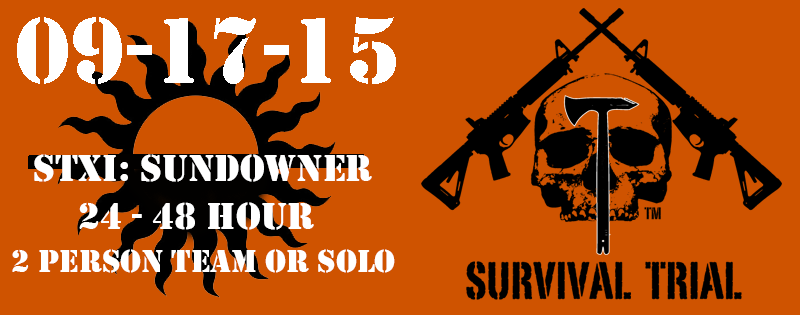
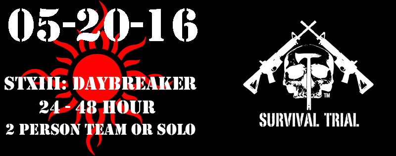
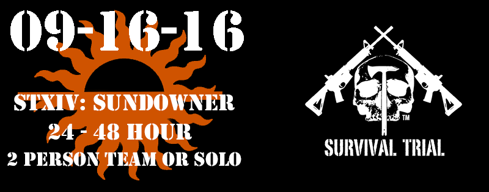

      

   

      

        <h1>Survival Trial</h1>
        <h2>The Ultimate Test</h2>
        <a href="/about/" class="btn-inverse">Learn More</a> &nbsp; or &nbsp; <a href="http://store-survivaltrial-com.3dcartstores.com/" class="btn-inverse">Register</a>
      
<!-- /.page-lead-content -->
    
<!-- /.page-lead -->
    

<h2>
Survival Trial is an Adventure Race like no other.  Each Trial brings realistic survival situations to a strategy based Adventure Race.  Survival Trial Arenas encompass over 120 square miles of beautifully rugged terrain in NE New Mexico.
</h2>
  

<h2>
Relevant survival scenarios are designed to challenge your body, mind, and spirit, all while giving each Competitor the opportunity to learn new skills.

</h2>

__________________________________________________________________________________________________

<h1>
Click Below to Register for an Upcoming Survival Trial!
</h1>

<h2>
Scenes from the STVIII: Sundowner!
</h2> 
  	   
<iframe width="560" height="315" src="https://www.youtube.com/embed/NFObCsDeEy4" frameborder="0" allowfullscreen></iframe>

<h2>
Scenes from the STVII: Daybreaker!
</h2> 
  	   
<iframe width="560" height="315" src="https://www.youtube.com/embed/r-W1IN5v-dc?list=PLVxvjseUtV0N81EJ___1GkL7vThlPWVeT" frameborder="0" allowfullscreen></iframe>

__________________________________________________________________________________________________

<h2>
Survival Trial are proud supporters of Boot Campaign.  Click below for more information on this great Veteran Organization.
</h2>

__________________________________________________________________________________________________

<!-- Begin MailChimp Signup Form -->
<link href="//cdn-images.mailchimp.com/embedcode/classic-081711.css" rel="stylesheet" type="text/css">

<form action="//survivaltrial.us6.list-manage.com/subscribe/post?u=9b39ee60e59a09343aa9e6c29&amp;id=e02a18fb35" method="post" id="mc-embedded-subscribe-form" name="mc-embedded-subscribe-form" class="validate" target="_blank" novalidate>
    

	<h2>Subscribe to the Survival Trial Newsletter</h2>

* indicates required

	<label for="mce-EMAIL">Email Address  *
</label>
	<input type="email" value="" name="EMAIL" class="required email" id="mce-EMAIL">

	<label for="mce-FNAME">First Name </label>
	<input type="text" value="" name="FNAME" class="" id="mce-FNAME">

	<label for="mce-LNAME">Last Name </label>
	<input type="text" value="" name="LNAME" class="" id="mce-LNAME">

	

		

		

	
    <!-- real people should not fill this in and expect good things - do not remove this or risk form bot signups-->
    
<input type="text" name="b_9b39ee60e59a09343aa9e6c29_e02a18fb35" tabindex="-1" value="">

    
<input type="submit" value="Subscribe" name="subscribe" id="mc-embedded-subscribe" class="button">

    

</form>

<!--End mc_embed_signup-->

__________________________________________________________________________________________________

<h1>
Survival Trial takes place at the NRA Whittington Center in NE New Mexico:
</h1>

__________________________________________________________________________________________________

<h1>
Support our Partners!
</h1>

__________________________________________________________________________________________________

  <h2 class="post-title">Professional Marksmen Inc.</h2>
  

<!-- /.tile -->

  <h2 class="post-title">NRA Whittington Center</h2>
  

<!-- /.tile -->

  <h2 class="post-title">MyTopo</h2>
  

<!-- /.tile -->

  <h2 class="post-title">Whittington U</h2>
  

<!-- /.tile -->

  <h2 class="post-title">Triple Aught Design</h2>
  

<!-- /.tile -->

<!-- /.tiles -->

