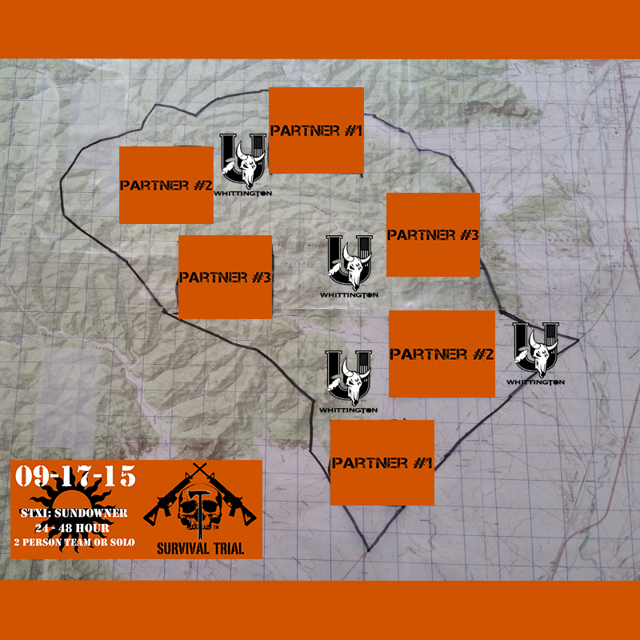
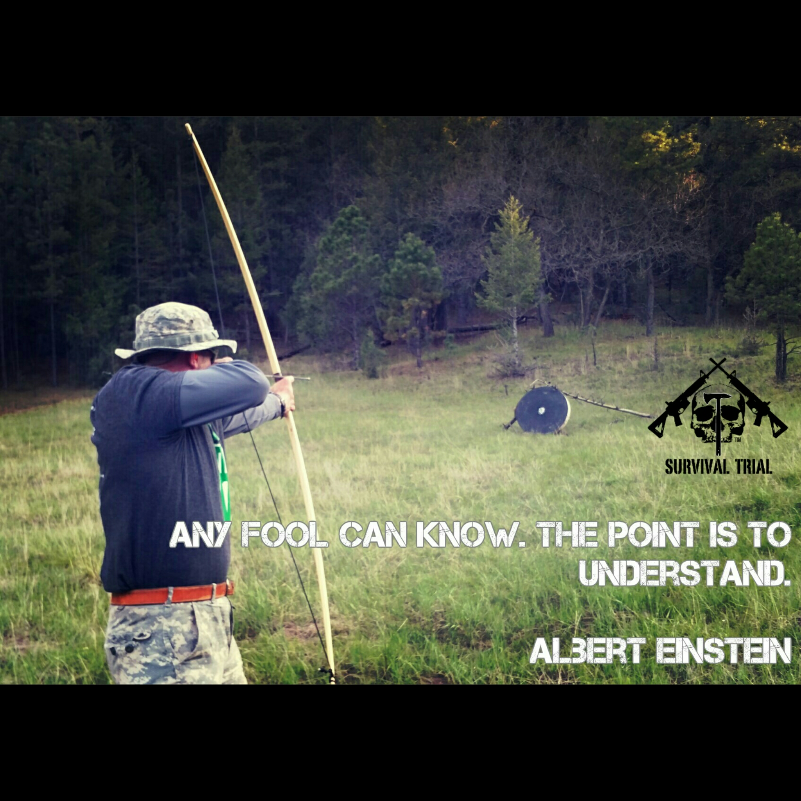
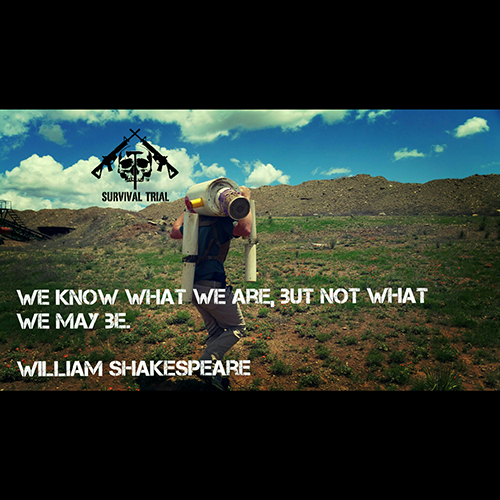
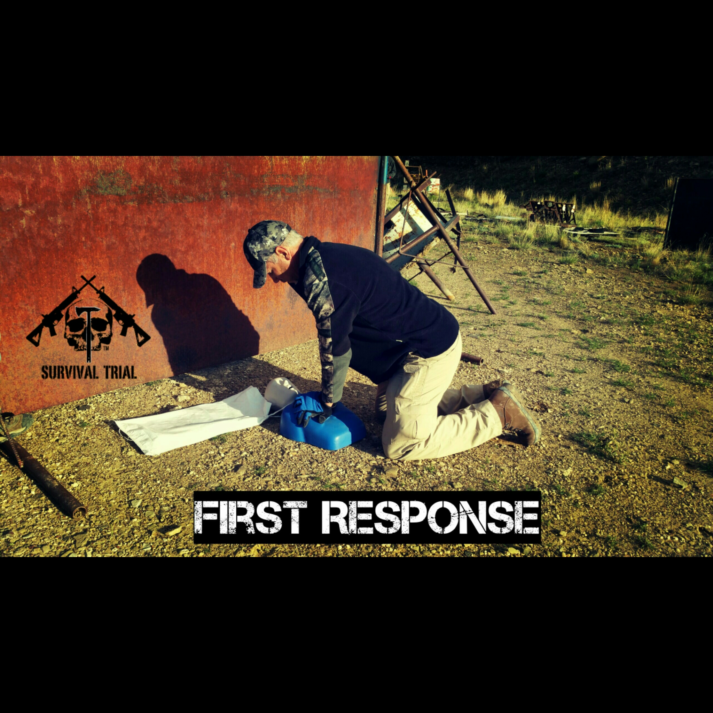
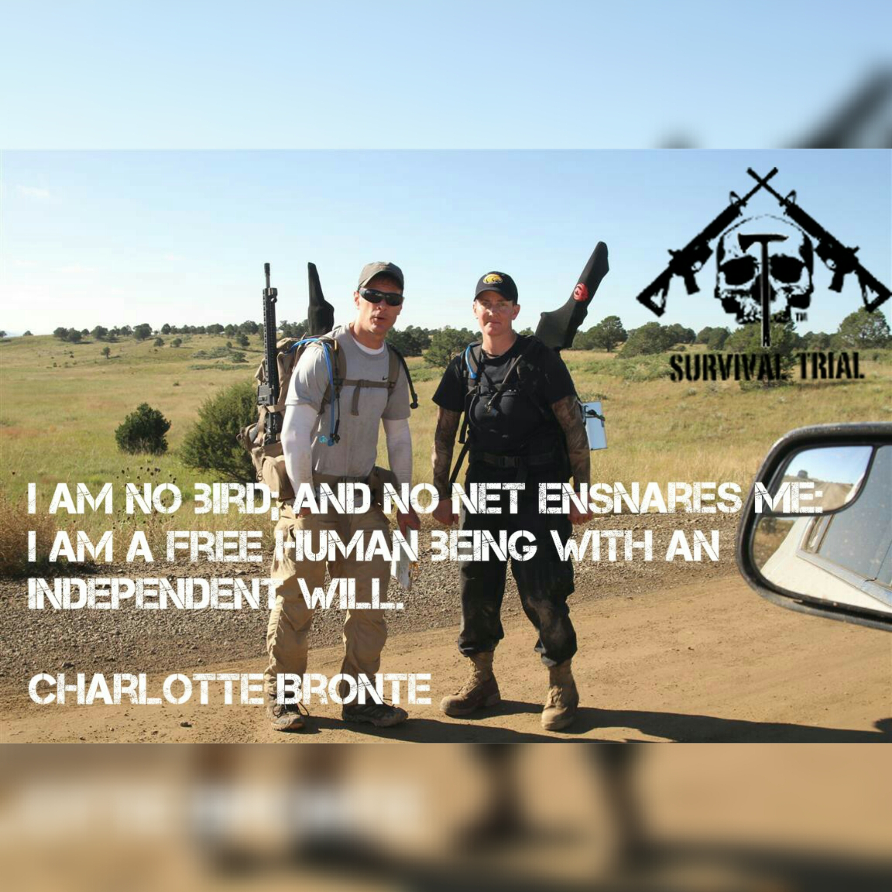
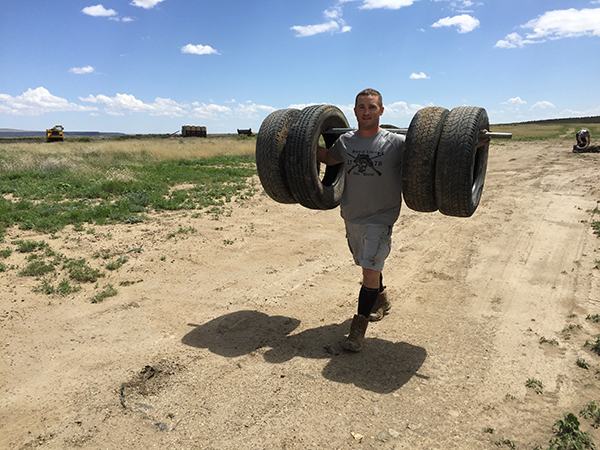

      

# Survival Trial is the Ultimate Test:

<h2>2015 Sundowner Arena</h2>

You are invited to participate as a Partner in the ST Sundowner Arena during the week of September 17-19, 2015.   Survival Trial is a great way to connect with your customer base, directly as it relates to your product and/or services.  

<li>Each Partner will have a section of the ST Arena to create Responses and Problems</li>

<li>Your Organization can create Physical and Mental Scenarios within a series of parameters
<li>Your Organization will be part of the Planning Phase of the Sundowner
<li>Partners have the opportunity to participate in the After-Race, After-Party, immediately following the 								Trial.

<li>NRA Whittington Center is the Site Sponsor:  (http://www.nrawc.org) 
<li>Whittington U (http://www.nrawc.org/training) and Professional Marksmen Inc. (http://www.professionalmarksmen.com) will create and facilitate all the Defensive Engagements in the ST Arena.
<li>Survival Trial will offer a Veteran Organization as a fundraising beneficiary:  Boot Campaign (http://www.bootcampaign.com) 

<h2>Guidelines:</h2>

<li>Partners will not overtly market their products or services in their Physical/Mental Response or Problem.  They can utilize the products or services in the Response or Problem, but as a structural piece only.</li>  
<li>Partners must attend the Survival Trial Planning Day and Pitch their Layouts/Ideas.</li>  
<li>Partners will set up, run and take down their Responses and Problems</li>  
<li>Partners must not infringe on other Partners’ sections of the Arena</li>  
<li>Partners will provide additional items to help dress their Physical/Mental Response or Problem, as they see fit to enhance their overall goal or feel</li>  
<li>Partners will provide their own Volunteers to run their Response or Problem</li>  

<h1>Survival Trial is the Ultimate Test.</h1>

## Test of Endurance:

Movement is required in Survival Trial, this is a given.  Competitors will move by foot only, carrying only what they need to survive in the ST Arena.  There is also periods of darkness involved in the 24 Hour or 48 Hour races; movement does not stop.  

## Test of Skill (Not limited to):

<li>Land Navigation/Orienteering</li>  
<li>Lashing</li>  
<li>Archery	Fire</li>  
<li>Construction</li>  
<li>Evasion</li>  	
<li>Shelter Building</li>  
<li>Mechanics</li>  	
<li>Leverage</li>  
<li>Defensive Firearm Engagements</li>  	
<li>Construction</li>  

## Test of Strength:

The emotional state dictates the mental response that controls the physical reaction.  Strength does not always mean the ability to lift heavy objects; strength is the ability to go on when every part of your body is telling you to stop.

## Test of Equipment

We all have gear and we all have plans.  What we all lack is an opportunity to put those plans into motion.  Survival Trial is that opportunity.

## Test of Relationships

The Teams of Survival Trial endure everything together.  The highs and lows, failure and success; everything is earned as a Team.  

## Test of Perception

We all have an idea of what we cannot do.  We see impossibility in many situations every day.  Survival Trial shows us what we can do, if we were only to try.

## Test of Preparation

Fitness is the cornerstone of a healthy lifestyle.  Life gets in the way of this sometimes.  The light will shine on success and failure in our preparation at different portions of the journey of Survival Trial.

# Survival Trial Sundowner Arena

The Survival Trial Arena is 52-120 square miles of mountainous and high desert plains located at the NRA Whittington Center in beautiful NE New Mexico.  The ST Arenas are populated with Physical Responses, Problems and Defensive Situations.  

Everything within the ST Arenas are scored and the highest amount of points acquired in the 24 hour or 48 hour timeframe win Survival Trial.  Strategy and endurance are the key to success.

## Responses:

Survival Trial Responses are situations designed to provoke a physical or mental response.  These are situations taken from News Reports that are current within the past 3 weeks prior to the beginning of the Trial.  

The Responses can involve physical activity, puzzle solving, or skill-set development.  The important aspect is that it revolves around a real world survival situation that challenges everyone who attempts it on multiple levels.

## Problems:

Problems are special areas in the ST Arenas.  They are generally guided by riddles and potential multiple outcomes.

The intent of all Problems are to force Competitors to think of the best solution outcome.  These problems can be encountered at any point in the Survival Trial Journey and will leave a lasting effect on Competitors.  Just as it is in Life, there is not always a right or wrong answer.

## Defensive Situations:

Survival is Defensive, a Defensive Posture helps ensure Survivability.  All Competitors have the opportunity to negotiate Defensive Situations that incorporate defensive shooting with the sidearm, shotgun or semi-automatic rifle.  

All Defensive Situations are taken from the News within a 3 week period to the Trial start date, so it keeps the reasons for testing skill and consistency under stress relevant to our Everyday.  Like everything in Survival Trial, Defensive Situations are optional.

## Equipment List:

We provide a suggested equipment list for the Trials, nothing is mandatory to compete.  You bring what you believe will make you successful during your 24 or 48 hour journey through the Arena.  There are prohibited items that are not allowed in the arena, which is laid out on the survival trial website:  http://survivaltrial.com/packing/.
 
## Firearms:

Firearms are part of Survival Trial.  Being a Survival-Based Adventure Race, there is no way firearms would not be part of it.  Whether we like the idea of guns or not, they are a very important tool in the defense of our Lives and our loved ones.  

Nothing is mandatory in the Survival Trial Arena; all competitors have the opportunity do everything or nothing at all.  

Staged firearms are also provided at the Defensive Situations, meaning that the firearm itself needed to negotiate the situation is prepared at the location.  Competitors have the choice to bring their own or use ours.  
Competitors will supply their own ammunition and attend a safety course prior to the start of every Survival Trial.

# Choice:

The Survival Trial is not a linear race, Competitors are given a list of coordinates and are required to plot their points.  

Competitors also have the freedom to plan their routes and move to their plotted locations.  
Choice and strategy play an integral role in Survival Trial.  Competitors know what their locations are prior to navigating.  This means Competitors can play to their strengths and acquire the highest amount of points in their race.

___________________________________________________________

Contact us:

info@survivaltrial.com
